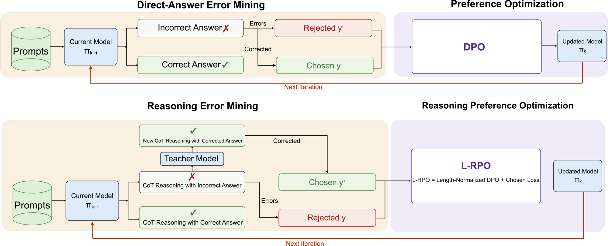

# **TELLER: Dual-Path Iterative Preference Optimization for Table Entity Linking**

> 🇬🇧 English version: [README.md](README.md)

本仓库做的事情：把 [MammoTab](https://unimib-datai.github.io/mammotab-docs/) 表格实体链接（Cell-Entity Annotation, CEA）数据转成 [TableInstruct](https://huggingface.co/datasets/osunlp/TableInstruct) 风格的指令微调样本，然后在 `meta-llama/Llama-3.1-8B` 上依次做 SFT、CoT-SFT、DPO(RL) 训练，并在 MammoTab 验证集和 TableInstruct 的 entity-linking 测试集上做评测。

所有命令行命令都已经整理成脚本，放在项目根目录的 `[scripts/](scripts/)` 目录下，按执行顺序编号（`00_` ~ `45_`）。本文档只解释每一步在做什么、脚本里关键参数的含义，实际命令请直接看对应的 `.sh` 文件（可以直接 `bash scripts/xxx.sh` 运行，运行前请按自己的实际路径改一下里面的 `~/DATA/...`、`/DATA1/khli/...` 等路径）。

## 目录

1. [数据集下载](#1-数据集下载)
2. [MammoTab → TableInstruct 格式转换](#2-mammotab--tableinstruct-格式转换mammotab2ti)
3. [环境准备](#3-环境准备)
4. [训练流程总览](#4-训练流程总览)
5. [路线 A：SFT → DPO-1 → DPO-2](#5-路线-asft--dpo-1--dpo-2)
6. [路线 B：SFT → CoT-SFT → DPO-1 → DPO-2](#6-路线-bsft--cot-sft--dpo-1--dpo-2)
7. [TableInstruct 6 数据集上的最终对比](#7-tableinstruct-6-数据集上的最终对比)
8. [结果汇总](#8-结果汇总)
9. [脚本速查表](#9-脚本速查表)

---


## 1. 数据集下载


### 1.1 MammoTab（表格 + Wikidata 标注，训练数据来源）

- 项目主页 / 文档：[https://unimib-datai.github.io/mammotab-docs/](https://unimib-datai.github.io/mammotab-docs/)
- 代码仓库（生成/重建数据集的 pipeline）：[https://github.com/unimib-datAI/mammotab](https://github.com/unimib-datAI/mammotab)
- 数据下载（Zenodo，`mammotab_full.zip`，约 14.6GB，共 838,930 张从英文 Wikipedia 抽取的表格 + CEA/CTA/CPA 标注 + JSON 元数据）：
[https://zenodo.org/records/16562700](https://zenodo.org/records/16562700)

下载解压后，需要的是"每张表格一个 JSON 文件"的目录（文件里含表格文本 `text` 矩阵、`caption`、页面标题、目标单元格的 gold QID 等），本仓库里默认放在：

```text
~/DATA/mammotab/mammotab_dataset_semtab/json/
```

> 如果你从 Zenodo 下载到的是原始 CSV（table + CEA 标注）+ JSON 元数据的组合，需要先按 MammoTab 官方 pipeline（`unimib-datAI/mammotab` 仓库）或自己写一个转换脚本，把每张表格拼成上面这种单文件 JSON（至少要包含 `text`/表格矩阵、`caption`、页面/章节标题，以及每个目标单元格的 gold QID/wiki 标题），下面第 2 步的 `mammotab2ti/stage1_extract_jobs.py` 就是直接扫描这个目录。


### 1.2 Wikidata truthy dump（离线候选实体检索库）

`mammotab2ti/stage0_build_wikidata_index.py` 需要一份 Wikidata dump 来建本地候选实体索引（sqlite）。推荐用体积小很多的 **truthy** 版本（只含 best-rank 的直接陈述，不含 qualifier/reference）：

```bash
bash scripts/01_download_wikidata_dump.sh
```

- 官方索引页：[https://dumps.wikimedia.org/wikidatawiki/entities/](https://dumps.wikimedia.org/wikidatawiki/entities/)
- 说明页：[https://www.wikidata.org/wiki/Wikidata:Database_download](https://www.wikidata.org/wiki/Wikidata:Database_download)
- 文件约 40GB（`.nt.bz2`），下载 + 解析建库耗时较长，建议 `nohup` 后台跑（见第 2 步）。
- 也支持 `.json`/`.json.gz`/`.json.bz2` 格式的 dump，`stage0_build_wikidata_index.py` 会按后缀自动识别走对应解析分支。


### 1.3 TableInstruct（跨任务指令微调数据集 + out-of-domain 测试集）

- Hugging Face 数据集页：[https://huggingface.co/datasets/osunlp/TableInstruct](https://huggingface.co/datasets/osunlp/TableInstruct)
- 论文/代码：[https://github.com/OSU-NLP-Group/TableLlama](https://github.com/OSU-NLP-Group/TableLlama)

```python
from datasets import load_dataset
ds = load_dataset("osunlp/TableInstruct")
```

本项目主要用到其中的实体链接（entity linking）测试集（`/eval_data` 下），用来做**跨数据集泛化测试**（不是训练数据，只是评测基准，训练全程只用 MammoTab）。评测脚本里对应的文件是（按同一套"同行同列 + 全部表头 + 缩到 10 行"的简化规则处理过）：

```text
/DATA1/khli/tablellama/ent_link_test_simplified.json
```

### 1.4 CoT-SFT 和 L-RPO 训练数据（可直接使用，两轮都有）

`CoT_SFT` 的训练数据，以及路线 B（第 6 节）**两轮** `L-RPO` 的训练数据，都放在下面这个链接里：

[https://drive.google.com/drive/folders/1sFFNwRhyzyrelDKn6Z-S_Vac_BaCiD3R?usp=sharing](https://drive.google.com/drive/folders/1sFFNwRhyzyrelDKn6Z-S_Vac_BaCiD3R?usp=sharing)

---


## 2. MammoTab → TableInstruct 格式转换（`mammotab2ti/`）

整条转换 pipeline 分 5 步（stage0 只建索引一次，可复用；stage1~4 是数据处理主链路），对应脚本 `scripts/02_*.sh` ~ `scripts/06_*.sh`：

```text
stage0_build_wikidata_index.py   Wikidata dump -> 本地 sqlite 候选检索库        scripts/02_stage0_build_wikidata_index.sh
stage1_extract_jobs.py           88万张表格 JSON -> 逐 mention 的 jobs.jsonl    scripts/03_stage1_extract_jobs.sh
stage2_generate_candidates_offline.py   jobs.jsonl + sqlite -> tableInstruct-like 样本   scripts/04_stage2_generate_candidates.sh
stage3_merge_single_shards.py    合并各 shard 输出 + 数据清洗                   scripts/05_stage3_merge_shards.sh
stage4_simplify.py               只保留同行同列 + 全部表头，行数压到 <=10       scripts/06_stage4_simplify.sh
```


### Stage 0：建 Wikidata 本地索引

```bash
bash scripts/02_stage0_build_wikidata_index.sh
```

- 输入：`--dump` Wikidata dump 文件。
- 输出：`--db` 一个 sqlite 文件，里面有 `entities`（qid/label/description/p31/aliases/enwiki_title/popularity...）和 `alias_index` 两张表，供 stage2 检索候选实体用。
- 这一步只需要跑一次，之后所有 stage2 任务复用同一个 `.sqlite`。


### Stage 1：从 MammoTab JSON 抽取 mention 级别的 job 队列

```bash
bash scripts/03_stage1_extract_jobs.sh
```

把 88 万张表格 JSON 展开成"一个待链接的实体 mention 一条记录"的 `jobs.jsonl`（每条含 `mention`/`column_name`/`row_index`/`page_title`/`section_title`/`table_caption`/`gold_qid`/`gold_wiki_title` 等）。

### Stage 2：本地候选检索 + 组装 tableInstruct-like 样本

```bash
bash scripts/04_stage2_generate_candidates.sh
```

- 对每条 mention，用 stage0 建好的本地索引取 top-20 候选实体，拼成 `instruction/input_seg/question/output` 四字段的样本（`output` 是 gold 答案的候选格式化文本，`question` 里带着未打乱的候选列表）。
- **不会**强制把 gold 塞进候选列表，同时写一份 `--audit_output`，记录每条样本的 `candidate_qids`/`gold_in_topk`，供 stage3 做清洗、以及事后统计"gold 有没有进 top20"。
- 数据量大（88 万张表 = 更多 mention），建议按 `--num_shards`/`--shard_id` 分片、每个 shard 起一个进程并行跑（这是纯 CPU/sqlite IO 任务，用 `python` 直接跑多个进程即可，不需要 `torchrun`；可以多次以不同 `--shard_id` 复制 `scripts/04_stage2_generate_candidates.sh` 并行提交），`--resume` 支持断点续跑。


### Stage 3：合并 shard + 数据清洗

```bash
bash scripts/05_stage3_merge_shards.sh
```

把 stage2 分 shard 生成的文件合并成一份，同时做三件事：

1. **补 gold**：如果 gold 答案不在候选列表里，把它加进候选列表（gold 是 `NIL` 或空字符串时不加）；
2. **打乱候选顺序**：用 `--seed` 固定的随机数对每条样本的候选列表重新排序，避免"正确答案总在同一位置"这种位置偏置；
3. **丢弃空候选**：候选列表为空的样本直接扔掉。


### Stage 4：简化表格上下文（只留同行同列 + 全部表头，行数 ≤10）

```bash
bash scripts/06_stage4_simplify.sh
```

目标：

1. 保留表头 + 目标实体所在的整行 + 其他行里"实体所在列"的那一格；
2. 只保留目标实体行附近的窗口（默认最多 10 行）；
3. 输出为一个 JSON 数组（`.json`），供后面 SFT/CoT-SFT/DPO 训练脚本直接读取。

关键是 `_infer_entity_position_from_input_and_question()` 怎么找到"实体在哪一行哪一列"：

1. 从 `question` 里正则抽两段信息：`selected entity mention in the table cell is: ...` 里的 **mention**，以及 `The column name for '...' is ...` 里的 **列名**；任一段抽不到就判定推断失败（返回 `None`）。
2. 从 `input_seg` 里把文本切成两段：`[TAB] ... col: ...` 之前的 `prefix`（用来解析表头 header cells），和从第一个 `row N:` 开始的 `rows_part`。
3. 把表头做空白归一化，用列名在表头列表里的位置定位**实体列 index**；找不到就失败。
4. 把 `rows_part` 按 `[SEP]` 切成每一行，每行再按 `row N: ...` 解析出行号和各单元格文本；逐行检查该行"实体列"对应的单元格文本里是否（大小写不敏感）包含 mention，第一个命中的行就是**实体行号**。
5. 都没命中则整体推断失败，此时默认（不加 `--keep_on_infer_failure`）会**丢弃**该样本；加上这个开关则保留原始未简化的 `input_seg`。

得到的 `stage4_single_shards_merge_simplified.json` 就是本仓库训练/评测统一使用的数据格式（`instruction`/`input_seg`/`question`/`output` 四字段），下文所有 `--data_path`/`--eval_data_path` 指的都是这类文件（或从其中切出的验证子集，如 `..._mam_val_last3750.json`）。

---


## 3. 环境准备

```bash
bash scripts/00_setup_env.sh
```

- 训练脚本（`el/sft.py` / `el/sft_CoT.py` / `rl/train_dpo.py` / `rl/train_dpo4sft.py`）都用 `transformers.HfArgumentParser` 的 dataclass 参数风格，命令行直接 `--字段名 值` 传参即可，多卡用 `torchrun --nproc_per_node=<GPU数>` 拉起。
- DPO 用的是 `trl.DPOTrainer`（固定 `trl==1.8.0`，其它版本字段可能不兼容）。
- CoT 阶段的 RL 数据生成（`rl/gen_dpo_data.py`）需要调用 DeepSeek 教师模型纠正本地模型答错的样本，需要先 `export DEEPSEEK_API_KEY=...`；SFT（非 CoT）阶段的 RL 数据生成（`rl/gen_dpo_data4sft.py`）不需要教师模型，直接用数据集里的 gold 作为 accept。
- base 模型：`meta-llama/Llama-3.1-8B`（需要 HuggingFace 账号 accept license 后 `huggingface-cli login`）。

---


## 4. 训练流程总览



*论文 Figure 1 ——**双路径迭代偏好优化（Dual-Path Iterative Preference Optimization）**。上半部分：直接答案路径用当前策略挖掘错误，构造 chosen/rejected 对后训练 DPO；下半部分：推理路径挖掘推理错误，训练 L-RPO（长度归一化 DPO + chosen 回答似然项）。两条路径都会把更新后的策略反馈回下一轮的错误挖掘。*

两条路线共享同一个 SFT 起点（`result_mammo2/checkpoint-21000`），之后分叉：

```text
                         el/sft.py (SFT)
                               │
                 result_mammo2/checkpoint-21000
                 ┌─────────────┴─────────────────────────┐
                 │                                       │
        路线 A（纯答案，不带推理）              路线 B（先学会 <think> 推理）
                 │                                       │
   rl/gen_dpo_data4sft.py                         el/sft_CoT.py (CoT-SFT, LoRA)
   rl/train_dpo4sft.py (DPO-1)                result_CoT_filtered_compressed_data_lora
   → result_dpo_sft                                       │
                 │                          rl/gen_dpo_data.py (DeepSeek 教师纠错)
   同样流程 (DPO-2)                          rl/filter_process_rl_data.py (过滤/压缩)
   → result_dpo_sft_i2                       rl/train_dpo.py (DPO-1) → result_dpo_v2
                                                             │
                                              同样流程 (DPO-2) → result_dpo_i2
```

两条路线的每个 checkpoint 都用两套评测：

- **MammoTab 验证集**（in-domain，`el/eval_checkpoint.py` 或 `el/eval_CoT_checkpoint.py`）；
- **TableInstruct 实体链接测试集**（out-of-domain 泛化测试，见第 7 节）。

---


## 5. 路线 A：SFT → DPO-1 → DPO-2


### 5.1 SFT（`el/sft.py`）

```bash
bash scripts/10_sft_train.sh
```

评测（MammoTab 验证集）：

```bash
bash scripts/11_eval_sft_mammotab.sh
```

MammoTab 验证集 accuracy：**0.8759**（8532/9741）。

### 5.2 生成 DPO 训练数据（`rl/gen_dpo_data4sft.py`）

用 SFT checkpoint 对训练数据做推理，答错的样本里：`accept` = gold 答案（规范化为候选实体格式），`reject` = 本地模型的原始生成。

```bash
bash scripts/20_gen_dpo_data4sft_round1.sh
```

> 默认读 `result_mammo2/checkpoint-21000`（可用 `--model` 指定其它 checkpoint，第二轮见 `scripts/23_gen_dpo_data4sft_round2.sh`），`--num` 控制样本量，`--resume` 支持多卡断点续跑（读取 `.rank*.jsonl` 分片）。这一步产出的 `{prompt, accept, reject}` pair 直接喂给 `rl/train_dpo4sft.py`，不需要像路线 B 那样再跑 `filter_process_rl_data.py`（因为这里的 `accept` 只是一句候选实体格式的 gold，没有 CoT 推理需要结构校验/压缩）。


### 5.3 DPO 第一轮（`rl/train_dpo4sft.py`）

```bash
bash scripts/21_train_dpo4sft_round1.sh
```

默认从 `result_mammo2/checkpoint-21000` 这个 adapter 继续训练（`--adapter_name_or_path` 可覆盖）。`--save_best_by_gen_eval True` 会在训练过程中周期性用真实 generate 在 `--gen_eval_data_path` 上跑一批样本估计 accuracy，按分数保留最好的几个 checkpoint。

评测（MammoTab 验证集）：

```bash
bash scripts/22_eval_dpo_sft_round1_mammotab.sh
```

MammoTab 验证集 accuracy：**0.8816**（8588/9741），相对 SFT 的 0.8759 有提升。

### 5.4 DPO 第二轮（用第一轮 checkpoint 重新生成数据）

重新用 `result_dpo_sft/checkpoint-150` 对训练数据推理，产出新一批 DPO pair，再训练第二轮：

```bash
bash scripts/23_gen_dpo_data4sft_round2.sh
bash scripts/24_train_dpo4sft_round2.sh
```

> 注意 `--adapter_name_or_path` 需要指向 `result_dpo_sft/checkpoint-150`（继续训练同一条 LoRA），而不是从 base SFT checkpoint 重新开始。

评测：

```bash
bash scripts/25_eval_dpo_sft_round2_mammotab.sh
```

MammoTab V2 accuracy：**88.20%**，相对第一轮的 88.16% 有小幅继续提升，与 out-of-domain 的 TableInstruct 测试集上的小幅提升趋势一致（见第 7 节）。

---


## 6. 路线 B：SFT → CoT-SFT → DPO-1 → DPO-2


### 6.1 CoT-SFT（`el/sft_CoT.py`，在 SFT LoRA 基础上继续训练一个新的 LoRA）

在路线 A 的 SFT checkpoint（`result_mammo2/checkpoint-21000`）基础上，用带 `<think>...</think>` 推理过程的 CoT 数据训一个新的 LoRA adapter（`--lora_only True` 表示只训新 LoRA，不动 embed/norm 等其它参数）：

```bash
bash scripts/30_sft_cot_train.sh
```

> CoT 训练数据（`merged_CoTSFT_all&all_filtered_cot_compressed.json`）本身是通过教师模型（DeepSeek）+ 后处理管线（结构过滤 → 质量过滤 → 长度压缩，见 6.3 的 `rl/filter_process_rl_data.py` 复用的三个函数）构造出的带 `<think>` 推理链的 SFT 样本；如何生成这份数据不在本文档范围内，可参照 `data_clean/compress_long_cot.py`、`data_clean/filter_low_info_cot.py`、`data_aug/augment_ent_link_thinking.py` 的思路。

评测（`el/eval_CoT_checkpoint.py`）：

```bash
bash scripts/31_eval_cot_sft_mammotab.sh
```

MammoTab 验证集 accuracy：**0.7822**（704/900，小样本口径）/ **0.7909**（7704/9741，全量口径）。CoT-SFT 单独看比纯 SFT（0.8759）略低——这是预期内的，因为它要多学一步"先推理再回答"，后面靠 DPO 把推理质量和答案正确率一起提上去。

### 6.2 生成 CoT-DPO 训练数据（`rl/gen_dpo_data.py`，本地模型 + DeepSeek 教师纠错）

```bash
export DEEPSEEK_API_KEY=...
bash scripts/32_gen_dpo_data_cot_round1.sh
```

流程：本地模型对训练数据批量推理 → 找出预测错误的样本，把其原始生成（含 `<think>`）作为 `reject` → 把"正确答案 + 要求不能引用/暗示答案"的 prompt 发给 DeepSeek 教师模型，生成一段真正推理出正确答案的 `<think>...</think>` 作为 `accept`（`--accept_max_reasoning_*` 控制教师生成的推理长度上限）。多卡按 round 轮转分片并行、`--resume` 支持断点续跑。

### 6.3 过滤 + 压缩 DPO 数据（`rl/filter_process_rl_data.py`）

```bash
bash scripts/33_filter_rl_data_round1.sh
```

三步流水线（全程 CPU，不需要 GPU）：

1. **结构过滤**：`accept` 必须能解析出 `<think>...</think>\n<entity>` 的结构，解析失败的整条丢弃；同时校验解析出的最终实体是否与 gold 一致，不一致也丢弃。`reject` 不做结构要求（截断/重复本身也是有信息量的负样本），只清理明显的格式崩坏。
2. **质量过滤**：给 `accept` 的推理内容打分，去掉啰嗦（rambling）、答案泄露（answer leakage）、照抄候选列表（copies candidate list）、没有实际论证（no justification）等低信息量样本。
3. **长度压缩**：`accept` 超过 `--compress-threshold-tokens` 时做抽取式压缩到 `--target-output-tokens` 以内；压缩失败（解析不出来 / 实体变了 / 仍超长 / 重复率太高）的样本整条丢弃。

可以先加 `--dry_run` 看每一步的漏斗统计，确认比例合理后再正式写出最终文件。

### 6.4 DPO 第一轮（`rl/train_dpo.py`）

```bash
bash scripts/34_train_dpo_cot_round1.sh
```

几个关键超参（脚本头部注释里有详细踩坑记录，简述如下）：

- `--rpo_alpha 0.5`：CoT 数据里 `accept`（教师生成的完整推理）系统性比 `reject`（本地模型的原始生成）长很多，标准 DPO 的 sigmoid pairwise loss 对序列 log-prob 求和、不做长度归一化，天然带"越长越优"的虚假梯度。`rpo_alpha>0` 会给 `loss_type` 加一个 `sft`（对 chosen 的交叉熵 NLL）分量，防止 chosen 似然被无意压低。
- `--length_normalize`（默认开）：把 pairwise loss 换成长度归一化版本，进一步缓解长度偏置。
- `--max_chosen_reject_len_ratio 6.0`：丢弃 `chosen`/`rejected` token 长度比过大的异常样本。
- `--save_best_by_gen_eval True`：按周期性真实 generate 得到的 `accuracy + has_think` 分数保留最好的 checkpoint。

评测：

```bash
bash scripts/35_eval_dpo_cot_round1_mammotab.sh
```

MammoTab V2 accuracy：**79.37%**†，相对 CoT-SFT 的 79.09% 有提升。† 这一轮用的是更早期、更完整的表格行序列化格式（9,741 条 prompt 里只有 99 条与本文其它地方统一使用的序列化格式完全一致）——详见第 8 节的脚注；这里仅作完整性展示，不用于配对显著性检验。

> `rpo_alpha`/`length_normalize` 关掉会怎样？消融实验 `result_dpo_v2_nolennorm`（`--length_normalize False`）掉到 69.53%，`result_dpo_v2_norpo`（`--rpo_alpha 0`）掉到 68.52%——说明这两个长度去偏技巧对这份数据是必需的，不是可选项（详见第 8 节的消融实验表）。


### 6.5 DPO 第二轮（用第一轮 checkpoint 重新生成 + 过滤数据）

重复 6.2 → 6.3，把 `--model`/`--checkpoint_dir` 换成 `result_dpo_v2/checkpoint-260`，产出新一批 pair 数据后训练第二轮：

```bash
export DEEPSEEK_API_KEY=...
bash scripts/36_gen_dpo_data_cot_round2.sh
bash scripts/37_filter_rl_data_round2.sh
bash scripts/38_train_dpo_cot_round2.sh
```

评测：

```bash
bash scripts/39_eval_dpo_cot_round2_mammotab.sh
```

MammoTab V2 accuracy：**81.85%**，相对第一轮的 79.37%† 继续提升。

---


## 7. TableInstruct 6 数据集上的最终对比

用两条路线各阶段的 checkpoint 在 TableInstruct 的实体链接测试集（`ent_link_test_simplified.json`，2000 条）上评测，检验训练是否只是过拟合 MammoTab、还是能泛化到别的表格来源：

```bash
bash scripts/40_eval_tableinstruct_sft.sh               # SFT
bash scripts/41_eval_tableinstruct_dpo_sft_round1.sh     # SFT -> DPO-1（路线 A）
bash scripts/42_eval_tableinstruct_dpo_sft_round2.sh     # SFT -> DPO-2（路线 A）
bash scripts/43_eval_tableinstruct_cot_sft.sh            # CoT-SFT（路线 B）
bash scripts/44_eval_tableinstruct_dpo_cot_round1.sh     # CoT-SFT -> DPO-1（路线 B）
bash scripts/45_eval_tableinstruct_dpo_cot_round2.sh     # CoT-SFT -> DPO-2（路线 B）
```

---


## 8. 结果汇总

下面的数字是我们论文——**TELLER: Dual-Path Iterative Preference Optimization for Table Entity Linking**（Kehao Li、Yixin Peng、Stefan Decker；OM 2026 Workshop @ ISWC，意大利巴里）——里报告的官方结果，评测集是完整的 TableInstruct 实体链接子集，以及 **MammoTab V2**（官方的 9,741 mention / 511 表评测集），而不是训练过程中仅用于挑 checkpoint 的那个更小的 3,750 表验证集。"Complete rationale"（完整推理率）指输出里 `<think>...</think>` 结构完整的比例，对直接答案模型不适用。


| 阶段                          | Checkpoint                                                | TableInstruct EL 准确率 | TableInstruct EL 完整推理率 | MammoTab V2 准确率 | MammoTab V2 完整推理率 |
| --------------------------- | --------------------------------------------------------- | -------------------- | ---------------------- | --------------- | ----------------- |
| Llama-3.1-8B（未微调基线）         | `meta-llama/Llama-3.1-8B`                                 | 58.60%               | n/a                    | 45.78%          | n/a               |
| 直接答案 SFT                    | `result_mammo2/checkpoint-21000`                          | 94.35%               | n/a                    | 87.59%          | n/a               |
| **路线 A** — 迭代 DPO 第一轮       | `result_dpo_sft/checkpoint-150`                           | 94.40%               | n/a                    | 88.16%          | n/a               |
| **路线 A** — 迭代 DPO 第二轮       | `result_dpo_sft_i2/checkpoint-100`                        | **94.50%**           | n/a                    | **88.20%**      | n/a               |
| CoT-SFT                     | `result_CoT_filtered_compressed_data_lora/checkpoint-350` | 92.90%               | 98.50%                 | 79.09%          | 87.09%            |
| **路线 B** — L-RPO 第一轮        | `result_dpo_v2/checkpoint-260`                            | 92.90%               | 99.70%                 | 79.37%†         | 89.63%            |
| **路线 B** — L-RPO 第二轮（数据已刷新） | `result_dpo_i2/checkpoint-210`                            | **92.95%**           | 99.55%                 | **81.85%**      | 91.86%            |


† L-RPO 第一轮在 MammoTab V2 上的这个数字，用的是更早期、更完整的表格行序列化格式（9,741 条 prompt 里只有 99 条与其它模型使用的统一序列化格式完全一致）；这里仅作完整性展示，不用于配对显著性检验。

与 MammoTab V2 公开榜单结果的对比（这里每个 mention 只产生一个预测，因此 exact-match accuracy 即对应 CEA 分数）：


| 方法                        | CEA (MammoTab V2) |
| ------------------------- | ----------------- |
| TURL (Deng et al.)        | 0.31              |
| Avogadro 2023             | 0.62              |
| TableLlama (Zhang et al.) | 0.86              |
| **迭代 DPO 第二轮（本文）**        | **0.882**         |


L-RPO 的损失项消融实验（LN = 长度归一化，RPO = chosen 回答似然项；对应本仓库里的 `result_dpo_v2_nolennorm`、`result_dpo_v2_norpo`、`result_dpo_i2_nolennorm`）：


| 变体               | LN  | RPO | MammoTab V2 准确率 | MammoTab V2 完整推理率 |
| ---------------- | --- | --- | --------------- | ----------------- |
| L-RPO 第二轮，完整版    | 是   | 是   | **81.85%**      | **91.86%**        |
| L-RPO 第二轮，去掉 LN  | 否   | 是   | 79.42%          | 87.54%            |
| L-RPO 第一轮，完整版†   | 是   | 是   | 79.37%          | 89.63%            |
| L-RPO 第一轮，去掉 LN  | 否   | 是   | 69.53%          | 77.06%            |
| L-RPO 第一轮，去掉 RPO | 是   | 否   | 68.52%          | 74.30%            |


简单结论：

- 迭代 DPO 在两个评测集上都呈单调提升（TableInstruct 上 94.35% → 94.40% → 94.50%；MammoTab V2 上 87.59% → 88.16% → 88.20%）。最终 MammoTab V2 分数（0.882 CEA）比公开榜单上此前最好的结果（TableLlama，0.86）高 2.2 个百分点。
- 迭代 L-RPO 相对 CoT-SFT 同时提升了准确率和推理完整性（TableInstruct 上 92.90% → 92.95% 准确率、98.50% → 99.55% 完整推理率；MammoTab V2 上 79.09% → 81.85% 准确率、87.09% → 91.86% 完整推理率）。在完全相同的 prompt 上，CoT-SFT → L-RPO 第二轮纠正了 817 条预测，只回退了 548 条——这个净提升在双侧精确 McNemar 检验下是显著的（$p<10^{-12}$）。
- 路线 A（直接答案）在两个评测集上都比路线 B（带推理）更准——显式推理带来了可测量的准确率代价，偏好优化能缩小但不能完全消除这个差距。
- 长度归一化和 RPO 风格的 chosen 回答似然项对 L-RPO 都是必需的：去掉任一个都会让第一轮 MammoTab V2 准确率从（两者都保留时的）~79% 掉到 69.53%（去掉 LN）或 68.52%（去掉 RPO）；第二轮去掉长度归一化同样会让准确率从 81.85% 掉到 79.42%。

---


## 9. 脚本速查表


| 脚本                                                  | 作用                                                            |
| --------------------------------------------------- | ------------------------------------------------------------- |
| `mammotab2ti/stage0_build_wikidata_index.py`        | Wikidata dump → 本地 sqlite 候选检索库                               |
| `mammotab2ti/stage1_extract_jobs.py`                | MammoTab 表格 JSON → 逐 mention job 队列                           |
| `mammotab2ti/stage2_generate_candidates_offline.py` | job + sqlite → tableInstruct-like 样本（分 shard）                 |
| `mammotab2ti/stage3_merge_single_shards.py`         | 合并 shard，补 gold / 打乱候选 / 丢空候选                                 |
| `mammotab2ti/stage4_simplify.py`                    | 简化表格上下文（同行同列 + 表头，≤10 行）                                      |
| `el/sft.py`                                         | 纯答案 SFT（无 CoT）                                                |
| `el/sft_CoT.py`                                     | 带 `<think>` 推理的 CoT-SFT（LoRA，可 continue 已有 SFT adapter）       |
| `el/eval_checkpoint.py`                             | 评测非 CoT checkpoint（SFT / SFT-DPO 系列）                          |
| `el/eval_CoT_checkpoint.py`                         | 评测 CoT checkpoint（CoT-SFT / CoT-DPO 系列）                       |
| `rl/gen_dpo_data4sft.py`                            | 为非 CoT 模型生成 DPO pair（`accept`=gold，`reject`=本地模型原始生成）         |
| `rl/gen_dpo_data.py`                                | 为 CoT 模型生成 DPO pair（`reject`=本地模型生成，`accept`=DeepSeek 教师纠错生成） |
| `rl/filter_process_rl_data.py`                      | CoT DPO 数据的结构过滤 + 质量过滤 + 长度压缩                                 |
| `rl/train_dpo4sft.py`                               | 非 CoT 模型的 DPO 训练（`trl.DPOTrainer`）                            |
| `rl/train_dpo.py`                                   | CoT 模型的 DPO 训练（`trl.DPOTrainer`，含长度去偏 / AuxDPO 等选项）           |


所有以上命令的具体 shell 脚本都在 `[scripts/](scripts/)` 目录下，按执行顺序编号，可以直接运行或者复制修改。